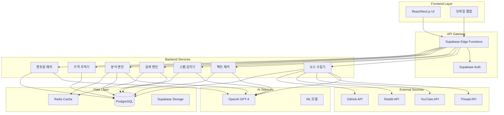

# VibeNews 아키텍처 개요

## 시스템 아키텍처 다이어그램



## 핵심 컴포넌트

### 1. Frontend Layer (프론트엔드 계층)
- **React/Next.js**: 서버 사이드 렌더링 지원
- **Tailwind CSS**: 반응형 디자인
- **TypeScript**: 타입 안전성
- **PWA 지원**: 오프라인 기능

### 2. API Gateway (API 게이트웨이)
- **Supabase Edge Functions**: 서버리스 백엔드
- **인증/인가**: JWT 기반 보안
- **Rate Limiting**: DDoS 방어
- **CORS 관리**: 크로스 오리진 정책

### 3. Backend Services (백엔드 서비스)

#### 뉴스 수집기 (News Collector)
```typescript
// 주요 기능
- 다중 소스 크롤링 (Thread, YouTube, Reddit, GitHub)
- AI 기반 콘텐츠 향상
- 중복 제거 알고리즘
- 자동 태그 생성
```

#### 팩트 체커 (Fact Checker)
```typescript
// 주요 기능
- 신뢰도 점수 계산 (0-100)
- AI 생성 콘텐츠 감지
- 표절 검사
- 소스 검증
```

#### 스팸 감지기 (Spam Detector)
```typescript
// 주요 기능
- 다중 신호 분석
- 실시간 필터링
- 독성 콘텐츠 차단
- 행동 패턴 분석
```

#### 검색 엔진 (Search Engine)
```typescript
// 주요 기능
- Full-text search (PostgreSQL tsvector)
- ML 기반 관련성 점수
- 쿼리 확장 및 동의어 처리
- 개인화 검색
```

#### 분석 엔진 (Analytics Engine)
```typescript
// 주요 기능
- 실시간 트렌딩 계산
- 다중 시간대 분석
- AI 트렌드 예측
- 플랫폼 KPI 추적
```

#### 가격 추적기 (Price Tracker)
```typescript
// 주요 기능
- 실시간 가격 모니터링
- 비교 매트릭스 생성
- 가격 변동 알림
- 도구별 추천
```

#### 멘토링 매처 (Mentoring Matcher)
```typescript
// 주요 기능
- AI 기반 매칭 알고리즘
- 스킬/도구/언어 매칭
- 세션 스케줄링
- 평가 시스템
```

### 4. AI Services (AI 서비스)
- **OpenAI GPT-4**: 콘텐츠 생성/분석
- **ML 모델**: 커스텀 예측 모델
- **NLP 처리**: 자연어 이해
- **컴퓨터 비전**: 이미지/비디오 분석

### 5. Data Layer (데이터 계층)
- **PostgreSQL**: 메인 데이터베이스
- **Redis Cache**: 성능 최적화
- **Supabase Storage**: 파일 저장소
- **백업 시스템**: 자동 백업/복구

## 데이터 플로우

### 1. 뉴스 수집 플로우
```
외부 소스 → 뉴스 수집기 → AI 처리 → 팩트 체킹 → 스팸 검사 → DB 저장
```

### 2. 사용자 콘텐츠 플로우
```
사용자 입력 → 스팸 검사 → 품질 평가 → DB 저장 → 인덱싱 → 검색 가능
```

### 3. 검색 플로우
```
검색 쿼리 → 쿼리 확장 → Full-text 검색 → ML 점수 계산 → 개인화 → 결과 반환
```

### 4. 트렌딩 플로우
```
활동 데이터 → 실시간 집계 → 점수 계산 → 속도 분석 → 트렌딩 결정 → 캐시 업데이트
```

## 보안 아키텍처

### 1. 인증/인가
- **OAuth 2.0**: 소셜 로그인
- **JWT 토큰**: 세션 관리
- **MFA 지원**: 2단계 인증
- **RLS**: Row-Level Security

### 2. 데이터 보호
- **암호화**: AES-256 (저장), TLS 1.3 (전송)
- **해싱**: SHA-256, bcrypt
- **마스킹**: PII 데이터 보호
- **감사 로그**: 모든 접근 기록

### 3. 위협 방어
- **DDoS 방어**: Cloudflare 통합
- **SQL 인젝션 방지**: 매개변수화 쿼리
- **XSS 방지**: 콘텐츠 새니타이징
- **CSRF 보호**: 토큰 검증

## 성능 최적화

### 1. 캐싱 전략
```typescript
// 캐시 레벨
L1: 브라우저 캐시 (5분)
L2: CDN 캐시 (15분)
L3: Redis 캐시 (1시간)
L4: DB 쿼리 캐시 (24시간)
```

### 2. 인덱싱 전략
```sql
-- 주요 인덱스
GIN 인덱스: Full-text 검색
B-tree 인덱스: 정렬/필터링
복합 인덱스: 다중 컬럼 쿼리
부분 인덱스: 조건부 최적화
```

### 3. 비동기 처리
- **Queue 시스템**: 백그라운드 작업
- **웹훅**: 이벤트 기반 처리
- **스트리밍**: 대용량 데이터 처리
- **배치 처리**: 효율적 일괄 작업

## 확장성 설계

### 1. 수평 확장
- **Edge Functions**: 자동 스케일링
- **데이터베이스**: Read 복제본
- **캐시 클러스터**: Redis 클러스터
- **CDN**: 글로벌 엣지 노드

### 2. 수직 확장
- **DB 인스턴스**: CPU/메모리 증설
- **연결 풀링**: 효율적 연결 관리
- **쿼리 최적화**: 실행 계획 개선
- **인덱스 튜닝**: 성능 최적화

## 모니터링 및 관찰성

### 1. 메트릭 수집
```yaml
시스템 메트릭:
  - CPU/메모리 사용률
  - 디스크 I/O
  - 네트워크 처리량
  
애플리케이션 메트릭:
  - 응답 시간 (p50, p95, p99)
  - 처리량 (req/s)
  - 오류율
  - 활성 사용자 수
  
비즈니스 메트릭:
  - 일일 활성 사용자 (DAU)
  - 콘텐츠 생성률
  - 검색 성공률
  - 트렌딩 정확도
```

### 2. 로깅
- **구조화 로깅**: JSON 형식
- **로그 집계**: 중앙 집중식
- **로그 분석**: 패턴 감지
- **알림 시스템**: 임계값 기반

### 3. 추적
- **분산 추적**: 요청 흐름 추적
- **성능 프로파일링**: 병목 지점 식별
- **오류 추적**: Sentry 통합
- **사용자 세션 추적**: 행동 분석

## 재해 복구 (DR)

### 1. 백업 전략
```yaml
백업 정책:
  실시간: 트랜잭션 로그 복제
  일별: 전체 DB 스냅샷
  주별: 증분 백업
  월별: 아카이브 백업
  
복구 목표:
  RPO: 1시간 (Recovery Point Objective)
  RTO: 4시간 (Recovery Time Objective)
```

### 2. 고가용성 (HA)
- **다중 가용 영역**: 지역 장애 대비
- **자동 페일오버**: 무중단 서비스
- **로드 밸런싱**: 트래픽 분산
- **헬스 체크**: 자동 복구

## 컴플라이언스

### 1. 데이터 규정
- **GDPR**: EU 데이터 보호
- **CCPA**: 캘리포니아 프라이버시
- **개인정보보호법**: 한국 규정
- **EU AI Act**: AI 규제 준수

### 2. 보안 표준
- **OWASP Top 10**: 보안 취약점 대응
- **SOC 2**: 보안 통제
- **ISO 27001**: 정보 보안 관리
- **PCI DSS**: 결제 카드 보안

## 기술 스택 요약

### Backend
- **Runtime**: Deno (Edge Functions)
- **Language**: TypeScript
- **Database**: PostgreSQL 15+
- **Cache**: Redis 7+
- **AI**: OpenAI GPT-4

### Frontend
- **Framework**: Next.js 14+
- **UI Library**: React 18+
- **Styling**: Tailwind CSS 3+
- **State**: Zustand/Redux Toolkit
- **Forms**: React Hook Form

### Infrastructure
- **Platform**: Supabase
- **CDN**: Cloudflare
- **Monitoring**: Datadog/New Relic
- **CI/CD**: GitHub Actions
- **Container**: Docker

### Tools
- **Version Control**: Git/GitHub
- **Project Management**: Jira/Linear
- **Documentation**: Markdown/Swagger
- **Testing**: Jest/Cypress
- **Code Quality**: ESLint/Prettier

## 결론

VibeNews 아키텍처는 **확장 가능성**, **보안**, **성능**을 최우선으로 설계되었습니다.
마이크로서비스 패턴과 서버리스 아키텍처를 결합하여 비용 효율적이면서도 강력한 시스템을 구축했습니다.

모든 컴포넌트는 독립적으로 확장 가능하며, AI 기반 기능들은 사용자 경험을 극대화합니다.
엔터프라이즈급 보안과 컴플라이언스를 준수하면서도 빠른 개발과 배포가 가능한 구조입니다.