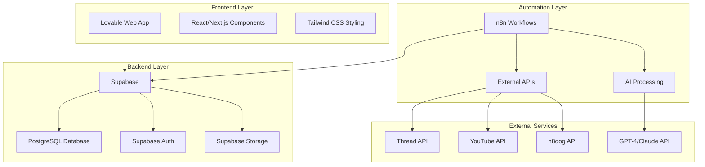
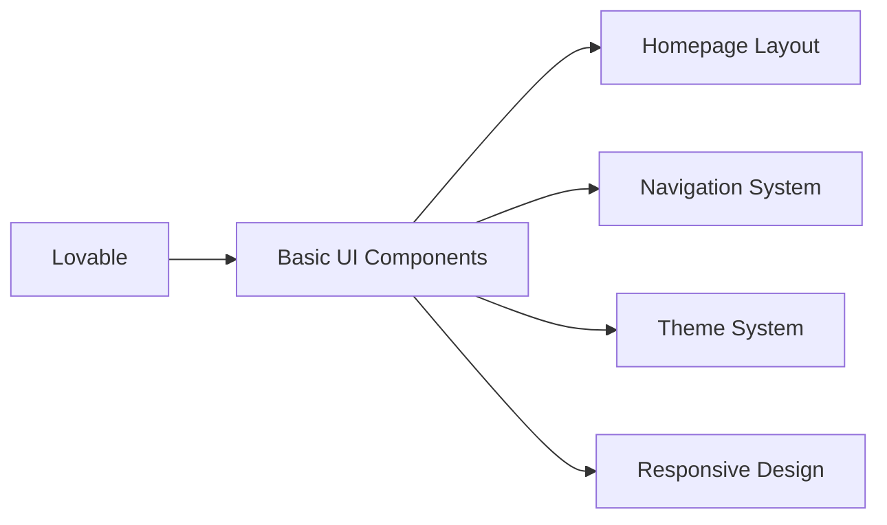
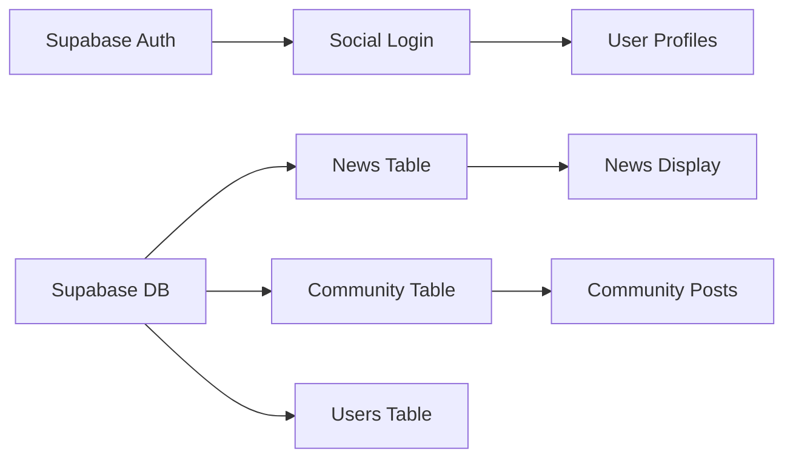
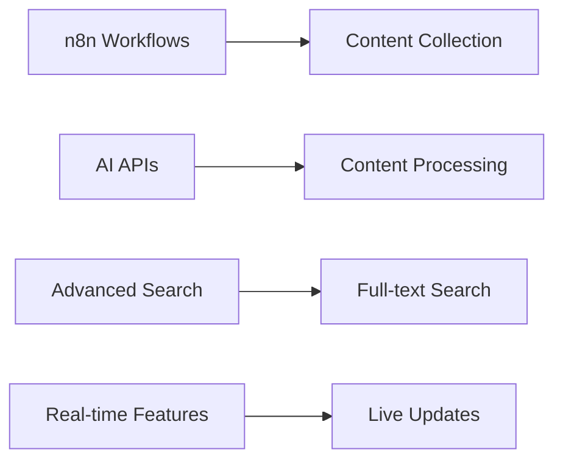
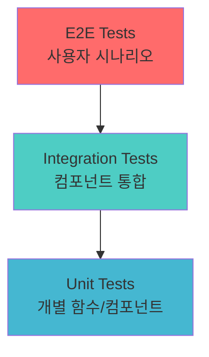
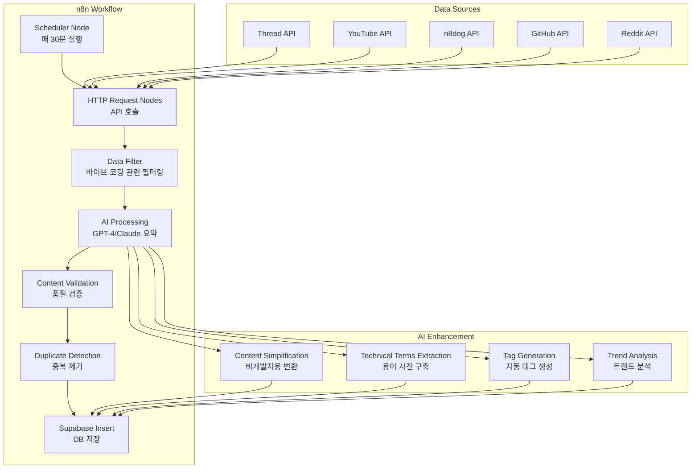
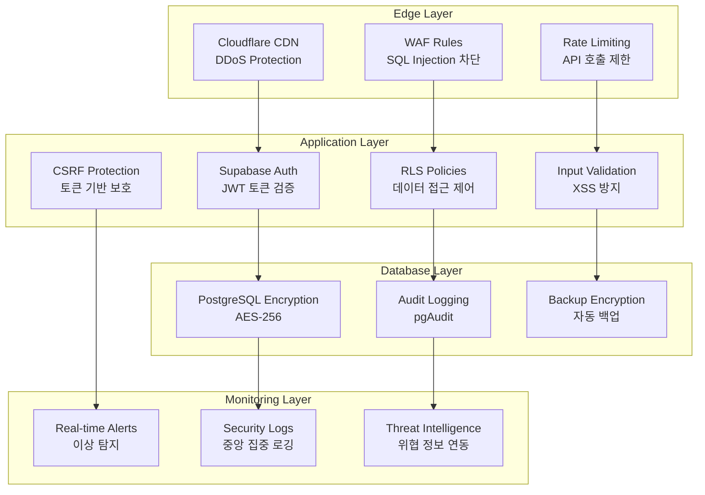
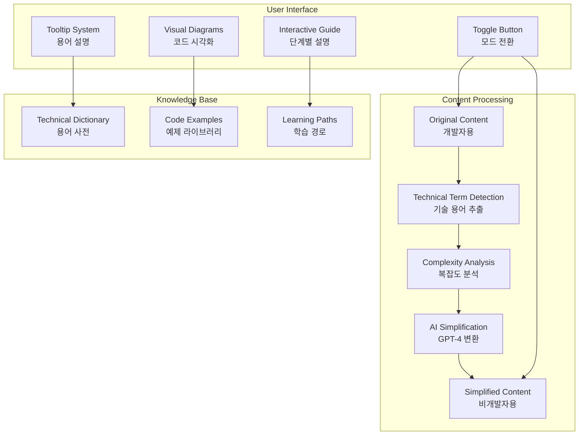
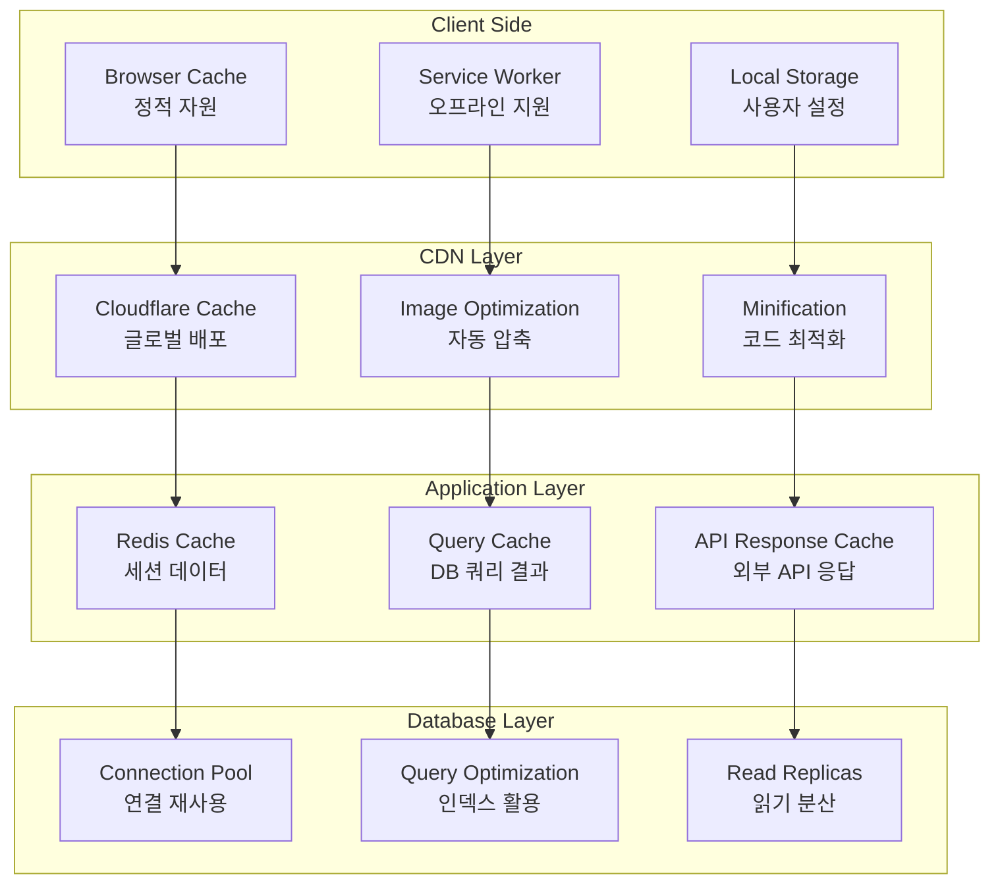

# VibeNews 설계 문서

## 개요

VibeNews는 AI 기반 자동 뉴스 수집과 사용자 커뮤니티가 통합된 바이브 코딩 전문 플랫폼입니다. Lovable을 통해 프론트엔드를 구축하고, Supabase를 백엔드로 사용하며, n8n을 통한 자동화 파이프라인을 구축하여 2025년 최신 바이브 코딩 트렌드를 실시간으로 제공합니다.

## 아키텍처

### 전체 시스템 아키텍처



### 3단계 구현 아키텍처

#### Phase 1: 핵심 UI/UX 기반


#### Phase 2: 인증 및 기본 기능


#### Phase 3: 고도화 기능


## 컴포넌트 및 인터페이스

### 프론트엔드 컴포넌트 구조

```
src/
├── components/
│   ├── layout/
│   │   ├── Header.tsx
│   │   ├── Navigation.tsx
│   │   ├── Footer.tsx
│   │   └── Sidebar.tsx
│   ├── news/
│   │   ├── NewsCard.tsx
│   │   ├── NewsDetail.tsx
│   │   ├── NewsList.tsx
│   │   └── NewsFilter.tsx
│   ├── community/
│   │   ├── PostCard.tsx
│   │   ├── PostDetail.tsx
│   │   ├── PostEditor.tsx
│   │   └── CommentSection.tsx
│   ├── user/
│   │   ├── UserProfile.tsx
│   │   ├── UserPosts.tsx
│   │   ├── LoginModal.tsx
│   │   └── ProfileSettings.tsx
│   ├── search/
│   │   ├── SearchBar.tsx
│   │   ├── SearchResults.tsx
│   │   ├── SearchFilters.tsx
│   │   └── SavedItems.tsx
│   └── common/
│       ├── Button.tsx
│       ├── Modal.tsx
│       ├── Loading.tsx
│       ├── ThemeToggle.tsx
│       └── LanguageSelector.tsx
├── pages/
│   ├── HomePage.tsx
│   ├── NewsPage.tsx
│   ├── CommunityPage.tsx
│   ├── SearchPage.tsx
│   ├── ProfilePage.tsx
│   └── SettingsPage.tsx
├── hooks/
│   ├── useAuth.ts
│   ├── useTheme.ts
│   ├── useSearch.ts
│   └── useSupabase.ts
├── utils/
│   ├── supabase.ts
│   ├── constants.ts
│   ├── helpers.ts
│   └── types.ts
└── styles/
    ├── globals.css
    ├── components.css
    └── themes.css
```

### 주요 인터페이스 정의

```typescript
// 사용자 인터페이스
interface User {
  id: string;
  email: string;
  nickname: string;
  avatar_url?: string;
  provider: 'google' | 'github' | 'naver';
  created_at: string;
  updated_at: string;
}

// 뉴스 기사 인터페이스
interface NewsArticle {
  id: string;
  title: string;
  content: string;
  content_simplified?: string; // 비개발자용
  summary: string;
  source_url: string;
  thumbnail?: string;
  tags: string[];
  author?: string;
  published_at: string;
  created_at: string;
  like_count: number;
  view_count: number;
  technical_terms?: TechnicalTerm[];
}

// 커뮤니티 게시글 인터페이스
interface CommunityPost {
  id: string;
  title: string;
  content: string;
  content_simplified?: string;
  author_id: string;
  author: User;
  tags: string[];
  like_count: number;
  comment_count: number;
  created_at: string;
  updated_at: string;
  is_featured: boolean;
  tools_used?: string[]; // 사용된 바이브 코딩 도구들
}

// 댓글 인터페이스
interface Comment {
  id: string;
  content: string;
  author_id: string;
  author: User;
  post_id?: string;
  article_id?: string;
  parent_id?: string; // 대댓글용
  created_at: string;
  like_count: number;
  replies?: Comment[];
}

// 기술 용어 인터페이스
interface TechnicalTerm {
  term: string;
  definition: string;
  category: 'tool' | 'concept' | 'technology';
}

// 검색 결과 인터페이스
interface SearchResult {
  type: 'news' | 'community' | 'comment';
  id: string;
  title: string;
  content: string;
  author?: string;
  created_at: string;
  relevance_score: number;
}
```

## 데이터 모델

### Supabase 데이터베이스 스키마

```sql
-- 사용자 테이블 (Supabase Auth 확장)
CREATE TABLE users (
  id UUID REFERENCES auth.users(id) PRIMARY KEY,
  email TEXT UNIQUE NOT NULL,
  nickname TEXT UNIQUE NOT NULL,
  avatar_url TEXT,
  provider TEXT NOT NULL,
  bio TEXT,
  website_url TEXT,
  github_username TEXT,
  twitter_username TEXT,
  created_at TIMESTAMP WITH TIME ZONE DEFAULT NOW(),
  updated_at TIMESTAMP WITH TIME ZONE DEFAULT NOW()
);

-- 뉴스 기사 테이블
CREATE TABLE news_articles (
  id UUID DEFAULT gen_random_uuid() PRIMARY KEY,
  title TEXT NOT NULL,
  content TEXT NOT NULL,
  content_simplified TEXT, -- 비개발자용 버전
  summary TEXT NOT NULL,
  source_url TEXT NOT NULL,
  thumbnail TEXT,
  tags TEXT[] DEFAULT '{}',
  author TEXT,
  published_at TIMESTAMP WITH TIME ZONE,
  created_at TIMESTAMP WITH TIME ZONE DEFAULT NOW(),
  updated_at TIMESTAMP WITH TIME ZONE DEFAULT NOW(),
  like_count INTEGER DEFAULT 0,
  view_count INTEGER DEFAULT 0,
  is_featured BOOLEAN DEFAULT FALSE,
  technical_terms JSONB DEFAULT '[]'
);

-- 커뮤니티 게시글 테이블
CREATE TABLE community_posts (
  id UUID DEFAULT gen_random_uuid() PRIMARY KEY,
  title TEXT NOT NULL,
  content TEXT NOT NULL,
  content_simplified TEXT,
  author_id UUID REFERENCES users(id) ON DELETE CASCADE,
  tags TEXT[] DEFAULT '{}',
  tools_used TEXT[] DEFAULT '{}', -- 바이브 코딩 도구들
  created_at TIMESTAMP WITH TIME ZONE DEFAULT NOW(),
  updated_at TIMESTAMP WITH TIME ZONE DEFAULT NOW(),
  like_count INTEGER DEFAULT 0,
  comment_count INTEGER DEFAULT 0,
  view_count INTEGER DEFAULT 0,
  is_featured BOOLEAN DEFAULT FALSE,
  is_pinned BOOLEAN DEFAULT FALSE
);

-- 댓글 테이블 (뉴스와 커뮤니티 통합)
CREATE TABLE comments (
  id UUID DEFAULT gen_random_uuid() PRIMARY KEY,
  content TEXT NOT NULL,
  author_id UUID REFERENCES users(id) ON DELETE CASCADE,
  article_id UUID REFERENCES news_articles(id) ON DELETE CASCADE,
  post_id UUID REFERENCES community_posts(id) ON DELETE CASCADE,
  parent_id UUID REFERENCES comments(id) ON DELETE CASCADE,
  created_at TIMESTAMP WITH TIME ZONE DEFAULT NOW(),
  updated_at TIMESTAMP WITH TIME ZONE DEFAULT NOW(),
  like_count INTEGER DEFAULT 0,
  is_edited BOOLEAN DEFAULT FALSE,
  CONSTRAINT comment_target_check CHECK (
    (article_id IS NOT NULL AND post_id IS NULL) OR
    (article_id IS NULL AND post_id IS NOT NULL)
  )
);

-- 좋아요 테이블
CREATE TABLE likes (
  id UUID DEFAULT gen_random_uuid() PRIMARY KEY,
  user_id UUID REFERENCES users(id) ON DELETE CASCADE,
  article_id UUID REFERENCES news_articles(id) ON DELETE CASCADE,
  post_id UUID REFERENCES community_posts(id) ON DELETE CASCADE,
  comment_id UUID REFERENCES comments(id) ON DELETE CASCADE,
  created_at TIMESTAMP WITH TIME ZONE DEFAULT NOW(),
  CONSTRAINT like_target_check CHECK (
    (article_id IS NOT NULL AND post_id IS NULL AND comment_id IS NULL) OR
    (article_id IS NULL AND post_id IS NOT NULL AND comment_id IS NULL) OR
    (article_id IS NULL AND post_id IS NULL AND comment_id IS NOT NULL)
  ),
  UNIQUE(user_id, article_id),
  UNIQUE(user_id, post_id),
  UNIQUE(user_id, comment_id)
);

-- 북마크/스크랩 테이블
CREATE TABLE bookmarks (
  id UUID DEFAULT gen_random_uuid() PRIMARY KEY,
  user_id UUID REFERENCES users(id) ON DELETE CASCADE,
  article_id UUID REFERENCES news_articles(id) ON DELETE CASCADE,
  post_id UUID REFERENCES community_posts(id) ON DELETE CASCADE,
  folder_name TEXT DEFAULT 'default',
  notes TEXT,
  created_at TIMESTAMP WITH TIME ZONE DEFAULT NOW(),
  CONSTRAINT bookmark_target_check CHECK (
    (article_id IS NOT NULL AND post_id IS NULL) OR
    (article_id IS NULL AND post_id IS NOT NULL)
  ),
  UNIQUE(user_id, article_id),
  UNIQUE(user_id, post_id)
);

-- 태그 테이블 (인기 태그 추적용)
CREATE TABLE tags (
  id UUID DEFAULT gen_random_uuid() PRIMARY KEY,
  name TEXT UNIQUE NOT NULL,
  usage_count INTEGER DEFAULT 0,
  category TEXT DEFAULT 'general', -- 'tool', 'concept', 'technology', 'general'
  description TEXT,
  created_at TIMESTAMP WITH TIME ZONE DEFAULT NOW()
);

-- 사용자 팔로우 테이블
CREATE TABLE user_follows (
  id UUID DEFAULT gen_random_uuid() PRIMARY KEY,
  follower_id UUID REFERENCES users(id) ON DELETE CASCADE,
  following_id UUID REFERENCES users(id) ON DELETE CASCADE,
  created_at TIMESTAMP WITH TIME ZONE DEFAULT NOW(),
  UNIQUE(follower_id, following_id),
  CONSTRAINT no_self_follow CHECK (follower_id != following_id)
);

-- 신고 테이블
CREATE TABLE reports (
  id UUID DEFAULT gen_random_uuid() PRIMARY KEY,
  reporter_id UUID REFERENCES users(id) ON DELETE CASCADE,
  target_type TEXT NOT NULL, -- 'article', 'post', 'comment', 'user'
  target_id UUID NOT NULL,
  reason TEXT NOT NULL,
  description TEXT,
  status TEXT DEFAULT 'pending', -- 'pending', 'reviewed', 'resolved', 'dismissed'
  created_at TIMESTAMP WITH TIME ZONE DEFAULT NOW(),
  resolved_at TIMESTAMP WITH TIME ZONE,
  resolved_by UUID REFERENCES users(id)
);

-- 기술 용어 사전 테이블
CREATE TABLE technical_terms (
  id UUID DEFAULT gen_random_uuid() PRIMARY KEY,
  term TEXT UNIQUE NOT NULL,
  definition TEXT NOT NULL,
  simple_definition TEXT NOT NULL, -- 비개발자용 설명
  category TEXT NOT NULL, -- 'tool', 'concept', 'technology'
  examples TEXT[],
  related_terms TEXT[],
  created_at TIMESTAMP WITH TIME ZONE DEFAULT NOW(),
  updated_at TIMESTAMP WITH TIME ZONE DEFAULT NOW()
);
```

### Row-Level Security (RLS) 정책

```sql
-- 사용자 테이블 RLS
ALTER TABLE users ENABLE ROW LEVEL SECURITY;

CREATE POLICY "Users can view all profiles" ON users
  FOR SELECT USING (true);

CREATE POLICY "Users can update own profile" ON users
  FOR UPDATE USING (auth.uid() = id);

-- 커뮤니티 게시글 RLS
ALTER TABLE community_posts ENABLE ROW LEVEL SECURITY;

CREATE POLICY "Anyone can view posts" ON community_posts
  FOR SELECT USING (true);

CREATE POLICY "Authenticated users can create posts" ON community_posts
  FOR INSERT WITH CHECK (auth.role() = 'authenticated');

CREATE POLICY "Users can update own posts" ON community_posts
  FOR UPDATE USING (auth.uid() = author_id);

CREATE POLICY "Users can delete own posts" ON community_posts
  FOR DELETE USING (auth.uid() = author_id);

-- 댓글 RLS
ALTER TABLE comments ENABLE ROW LEVEL SECURITY;

CREATE POLICY "Anyone can view comments" ON comments
  FOR SELECT USING (true);

CREATE POLICY "Authenticated users can create comments" ON comments
  FOR INSERT WITH CHECK (auth.role() = 'authenticated');

CREATE POLICY "Users can update own comments" ON comments
  FOR UPDATE USING (auth.uid() = author_id);

CREATE POLICY "Users can delete own comments" ON comments
  FOR DELETE USING (auth.uid() = author_id);

-- 좋아요 RLS
ALTER TABLE likes ENABLE ROW LEVEL SECURITY;

CREATE POLICY "Users can view all likes" ON likes
  FOR SELECT USING (true);

CREATE POLICY "Users can manage own likes" ON likes
  FOR ALL USING (auth.uid() = user_id);

-- 북마크 RLS
ALTER TABLE bookmarks ENABLE ROW LEVEL SECURITY;

CREATE POLICY "Users can only see own bookmarks" ON bookmarks
  FOR ALL USING (auth.uid() = user_id);
```

## 오류 처리

### 프론트엔드 오류 처리 전략

```typescript
// 에러 타입 정의
interface AppError {
  code: string;
  message: string;
  details?: any;
  timestamp: string;
}

// 에러 핸들링 훅
const useErrorHandler = () => {
  const [error, setError] = useState<AppError | null>(null);
  
  const handleError = (error: any) => {
    const appError: AppError = {
      code: error.code || 'UNKNOWN_ERROR',
      message: error.message || '알 수 없는 오류가 발생했습니다.',
      details: error.details,
      timestamp: new Date().toISOString()
    };
    
    setError(appError);
    
    // 로깅 (개발 환경에서만)
    if (process.env.NODE_ENV === 'development') {
      console.error('App Error:', appError);
    }
  };
  
  const clearError = () => setError(null);
  
  return { error, handleError, clearError };
};

// Supabase 에러 처리
const handleSupabaseError = (error: any) => {
  const errorMap: Record<string, string> = {
    'auth/user-not-found': '사용자를 찾을 수 없습니다.',
    'auth/wrong-password': '비밀번호가 올바르지 않습니다.',
    'auth/email-already-in-use': '이미 사용 중인 이메일입니다.',
    'PGRST116': '데이터를 찾을 수 없습니다.',
    'PGRST301': '권한이 없습니다.',
  };
  
  return errorMap[error.code] || error.message || '서버 오류가 발생했습니다.';
};
```

### 백엔드 오류 처리

```sql
-- 데이터베이스 제약 조건 및 트리거
CREATE OR REPLACE FUNCTION update_updated_at_column()
RETURNS TRIGGER AS $$
BEGIN
    NEW.updated_at = NOW();
    RETURN NEW;
END;
$$ language 'plpgsql';

-- 업데이트 시간 자동 갱신 트리거
CREATE TRIGGER update_users_updated_at BEFORE UPDATE ON users
    FOR EACH ROW EXECUTE FUNCTION update_updated_at_column();

CREATE TRIGGER update_community_posts_updated_at BEFORE UPDATE ON community_posts
    FOR EACH ROW EXECUTE FUNCTION update_updated_at_column();

CREATE TRIGGER update_comments_updated_at BEFORE UPDATE ON comments
    FOR EACH ROW EXECUTE FUNCTION update_updated_at_column();

-- 좋아요 수 자동 업데이트 함수
CREATE OR REPLACE FUNCTION update_like_count()
RETURNS TRIGGER AS $$
BEGIN
    IF TG_OP = 'INSERT' THEN
        IF NEW.article_id IS NOT NULL THEN
            UPDATE news_articles SET like_count = like_count + 1 WHERE id = NEW.article_id;
        ELSIF NEW.post_id IS NOT NULL THEN
            UPDATE community_posts SET like_count = like_count + 1 WHERE id = NEW.post_id;
        ELSIF NEW.comment_id IS NOT NULL THEN
            UPDATE comments SET like_count = like_count + 1 WHERE id = NEW.comment_id;
        END IF;
        RETURN NEW;
    ELSIF TG_OP = 'DELETE' THEN
        IF OLD.article_id IS NOT NULL THEN
            UPDATE news_articles SET like_count = like_count - 1 WHERE id = OLD.article_id;
        ELSIF OLD.post_id IS NOT NULL THEN
            UPDATE community_posts SET like_count = like_count - 1 WHERE id = OLD.post_id;
        ELSIF OLD.comment_id IS NOT NULL THEN
            UPDATE comments SET like_count = like_count - 1 WHERE id = OLD.comment_id;
        END IF;
        RETURN OLD;
    END IF;
    RETURN NULL;
END;
$$ LANGUAGE plpgsql;

CREATE TRIGGER likes_count_trigger
    AFTER INSERT OR DELETE ON likes
    FOR EACH ROW EXECUTE FUNCTION update_like_count();
```

## 테스트 전략

### 테스트 피라미드



### 테스트 구성

```typescript
// 단위 테스트 예시 (Jest + React Testing Library)
describe('NewsCard Component', () => {
  it('should render news article correctly', () => {
    const mockArticle = {
      id: '1',
      title: 'Test Article',
      summary: 'Test summary',
      tags: ['AI', 'Coding'],
      created_at: '2025-07-29T00:00:00Z',
      like_count: 5
    };
    
    render(<NewsCard article={mockArticle} />);
    
    expect(screen.getByText('Test Article')).toBeInTheDocument();
    expect(screen.getByText('Test summary')).toBeInTheDocument();
    expect(screen.getByText('AI')).toBeInTheDocument();
  });
});

// 통합 테스트 예시
describe('Authentication Flow', () => {
  it('should login user with Google OAuth', async () => {
    const { result } = renderHook(() => useAuth());
    
    await act(async () => {
      await result.current.signInWithGoogle();
    });
    
    expect(result.current.user).toBeTruthy();
    expect(result.current.isAuthenticated).toBe(true);
  });
});

// E2E 테스트 예시 (Playwright)
test('User can create and view community post', async ({ page }) => {
  await page.goto('/login');
  await page.click('[data-testid="google-login"]');
  
  await page.goto('/community');
  await page.click('[data-testid="create-post"]');
  
  await page.fill('[data-testid="post-title"]', 'Test Post');
  await page.fill('[data-testid="post-content"]', 'This is a test post');
  await page.click('[data-testid="submit-post"]');
  
  await expect(page.locator('text=Test Post')).toBeVisible();
});
```
## n8n 자동화 워크플로우 설계

### 뉴스 수집 및 처리 파이프라인



### n8n 워크플로우 노드 구성

```javascript
// 1. 스케줄러 노드 설정
{
  "node": "Schedule Trigger",
  "parameters": {
    "rule": {
      "interval": [
        {
          "field": "minutes",
          "value": 30
        }
      ]
    }
  }
}

// 2. Thread API 호출 노드
{
  "node": "HTTP Request",
  "parameters": {
    "url": "https://api.threads.net/v1/posts",
    "method": "GET",
    "headers": {
      "Authorization": "Bearer {{$env.THREAD_API_KEY}}"
    },
    "qs": {
      "q": "vibe coding OR AI coding OR Cursor OR Lovable OR Windsurf",
      "count": 50,
      "result_type": "recent"
    }
  }
}

// 3. AI 콘텐츠 처리 노드
{
  "node": "OpenAI",
  "parameters": {
    "resource": "chat",
    "model": "gpt-4",
    "messages": [
      {
        "role": "system",
        "content": "You are a technical content processor for VibeNews. Process the following content and provide: 1) A concise summary, 2) A simplified version for non-developers, 3) Extract technical terms, 4) Generate relevant tags, 5) Assess content quality (1-10)"
      },
      {
        "role": "user",
        "content": "{{$json.content}}"
      }
    ]
  }
}

// 4. Supabase 삽입 노드
{
  "node": "Supabase",
  "parameters": {
    "operation": "insert",
    "table": "news_articles",
    "data": {
      "title": "{{$json.title}}",
      "content": "{{$json.content}}",
      "content_simplified": "{{$json.simplified_content}}",
      "summary": "{{$json.summary}}",
      "source_url": "{{$json.url}}",
      "tags": "{{$json.tags}}",
      "technical_terms": "{{$json.technical_terms}}",
      "quality_score": "{{$json.quality_score}}"
    }
  }
}
```

## 보안 구현 방안

### 다층 보안 아키텍처



### 보안 정책 구현

```sql
-- 1. 고급 RLS 정책
CREATE POLICY "Advanced user data protection" ON users
  FOR ALL USING (
    auth.uid() = id OR 
    auth.jwt() ->> 'role' = 'admin' OR
    (auth.jwt() ->> 'role' = 'moderator' AND 
     NOT (email LIKE '%@admin.%'))
  );

-- 2. 콘텐츠 필터링 함수
CREATE OR REPLACE FUNCTION check_content_safety(content TEXT)
RETURNS BOOLEAN AS $$
DECLARE
    spam_keywords TEXT[] := ARRAY['spam', 'advertisement', 'buy now', 'click here'];
    keyword TEXT;
BEGIN
    FOREACH keyword IN ARRAY spam_keywords
    LOOP
        IF LOWER(content) LIKE '%' || keyword || '%' THEN
            RETURN FALSE;
        END IF;
    END LOOP;
    RETURN TRUE;
END;
$$ LANGUAGE plpgsql;

-- 3. 자동 신고 처리 트리거
CREATE OR REPLACE FUNCTION handle_report_threshold()
RETURNS TRIGGER AS $$
BEGIN
    IF (SELECT COUNT(*) FROM reports 
        WHERE target_type = NEW.target_type 
        AND target_id = NEW.target_id 
        AND status = 'pending') >= 3 THEN
        
        -- 자동으로 콘텐츠 숨김 처리
        IF NEW.target_type = 'post' THEN
            UPDATE community_posts 
            SET is_hidden = TRUE 
            WHERE id = NEW.target_id;
        ELSIF NEW.target_type = 'article' THEN
            UPDATE news_articles 
            SET is_hidden = TRUE 
            WHERE id = NEW.target_id;
        END IF;
        
        -- 관리자에게 알림 (실제로는 외부 서비스 호출)
        INSERT INTO admin_notifications (type, message, created_at)
        VALUES ('auto_hide', 'Content auto-hidden due to reports: ' || NEW.target_id, NOW());
    END IF;
    
    RETURN NEW;
END;
$$ LANGUAGE plpgsql;

CREATE TRIGGER report_threshold_trigger
    AFTER INSERT ON reports
    FOR EACH ROW EXECUTE FUNCTION handle_report_threshold();
```

### AI 기반 보안 모니터링

```typescript
// 실시간 위협 탐지 시스템
interface SecurityEvent {
  type: 'ddos' | 'sql_injection' | 'xss' | 'brute_force' | 'suspicious_activity';
  severity: 'low' | 'medium' | 'high' | 'critical';
  source_ip: string;
  user_id?: string;
  details: any;
  timestamp: string;
}

class SecurityMonitor {
  private threatPatterns = {
    ddos: /^(?:[0-9]{1,3}\.){3}[0-9]{1,3}.*requests\/sec > 1000/,
    sqlInjection: /(union|select|insert|update|delete|drop|create|alter).*['"]/i,
    xss: /<script|javascript:|on\w+\s*=/i,
    bruteForce: /failed_login_attempts > 5 in 5 minutes/
  };

  async analyzeRequest(request: any): Promise<SecurityEvent | null> {
    // AI 기반 이상 탐지
    const aiAnalysis = await this.callAIThreatDetection(request);
    
    if (aiAnalysis.threat_level > 0.7) {
      return {
        type: aiAnalysis.threat_type,
        severity: this.mapThreatLevelToSeverity(aiAnalysis.threat_level),
        source_ip: request.ip,
        user_id: request.user?.id,
        details: aiAnalysis.details,
        timestamp: new Date().toISOString()
      };
    }
    
    return null;
  }

  private async callAIThreatDetection(request: any) {
    // GPT-4 기반 위협 분석
    const response = await openai.chat.completions.create({
      model: "gpt-4",
      messages: [{
        role: "system",
        content: "You are a cybersecurity expert. Analyze the following request for potential threats and return a JSON with threat_level (0-1), threat_type, and details."
      }, {
        role: "user",
        content: JSON.stringify({
          ip: request.ip,
          user_agent: request.headers['user-agent'],
          path: request.path,
          method: request.method,
          body: request.body,
          query: request.query
        })
      }]
    });
    
    return JSON.parse(response.choices[0].message.content);
  }
}
```

## 비개발자 지원 시스템 설계

### AI 콘텐츠 변환 아키텍처



### 콘텐츠 변환 로직

```typescript
interface ContentTransformation {
  original: string;
  simplified: string;
  technicalTerms: TechnicalTerm[];
  visualElements: VisualElement[];
  complexity: number; // 1-10
}

class ContentSimplifier {
  async transformContent(content: string): Promise<ContentTransformation> {
    // 1. 기술 용어 추출
    const technicalTerms = await this.extractTechnicalTerms(content);
    
    // 2. 복잡도 분석
    const complexity = this.analyzeComplexity(content, technicalTerms);
    
    // 3. AI 기반 단순화
    const simplified = await this.simplifyWithAI(content, technicalTerms);
    
    // 4. 시각적 요소 생성
    const visualElements = await this.generateVisualElements(content);
    
    return {
      original: content,
      simplified,
      technicalTerms,
      visualElements,
      complexity
    };
  }

  private async simplifyWithAI(content: string, terms: TechnicalTerm[]): Promise<string> {
    const prompt = `
    Transform this technical content for non-developers:
    
    Original: ${content}
    
    Technical terms to explain: ${terms.map(t => t.term).join(', ')}
    
    Rules:
    1. Use simple, everyday language
    2. Replace jargon with analogies
    3. Break down complex concepts
    4. Add context and examples
    5. Maintain accuracy while improving accessibility
    `;

    const response = await openai.chat.completions.create({
      model: "gpt-4",
      messages: [{ role: "user", content: prompt }]
    });

    return response.choices[0].message.content;
  }

  private async generateVisualElements(content: string): Promise<VisualElement[]> {
    // 코드 블록을 플로우차트로 변환
    const codeBlocks = this.extractCodeBlocks(content);
    const visualElements: VisualElement[] = [];

    for (const code of codeBlocks) {
      const mermaidDiagram = await this.codeToMermaid(code);
      visualElements.push({
        type: 'flowchart',
        original: code,
        visual: mermaidDiagram,
        description: await this.explainCodeFlow(code)
      });
    }

    return visualElements;
  }
}

// React 컴포넌트 예시
const ContentViewer: React.FC<{ article: NewsArticle }> = ({ article }) => {
  const [isSimplified, setIsSimplified] = useState(false);
  const [hoveredTerm, setHoveredTerm] = useState<string | null>(null);

  return (
    <div className="content-viewer">
      <div className="content-controls">
        <button 
          onClick={() => setIsSimplified(!isSimplified)}
          className={`mode-toggle ${isSimplified ? 'simplified' : 'technical'}`}
        >
          {isSimplified ? '👨‍💻 개발자 모드' : '👤 일반인 모드'}
        </button>
      </div>
      
      <div className="content-body">
        {isSimplified ? (
          <SimplifiedContent 
            content={article.content_simplified}
            onTermHover={setHoveredTerm}
          />
        ) : (
          <TechnicalContent 
            content={article.content}
            onTermHover={setHoveredTerm}
          />
        )}
      </div>
      
      {hoveredTerm && (
        <TermTooltip 
          term={hoveredTerm}
          position="cursor"
        />
      )}
    </div>
  );
};
```

## 성능 최적화 전략

### 캐싱 전략



### 데이터베이스 최적화

```sql
-- 1. 성능 최적화 인덱스
CREATE INDEX CONCURRENTLY idx_news_articles_published_at 
ON news_articles (published_at DESC) 
WHERE is_hidden = FALSE;

CREATE INDEX CONCURRENTLY idx_community_posts_trending 
ON community_posts (like_count DESC, comment_count DESC, created_at DESC)
WHERE is_hidden = FALSE;

CREATE INDEX CONCURRENTLY idx_search_content 
ON news_articles USING gin(to_tsvector('english', title || ' ' || content));

CREATE INDEX CONCURRENTLY idx_tags_search 
ON news_articles USING gin(tags);

-- 2. 파티셔닝 (대용량 데이터 처리)
CREATE TABLE news_articles_2025_q3 PARTITION OF news_articles
FOR VALUES FROM ('2025-07-01') TO ('2025-10-01');

CREATE TABLE news_articles_2025_q4 PARTITION OF news_articles
FOR VALUES FROM ('2025-10-01') TO ('2026-01-01');

-- 3. 실시간 통계 뷰
CREATE MATERIALIZED VIEW trending_content AS
SELECT 
    'article' as type,
    id,
    title,
    like_count + comment_count * 2 + view_count * 0.1 as trend_score,
    created_at
FROM news_articles 
WHERE created_at > NOW() - INTERVAL '24 hours'
UNION ALL
SELECT 
    'post' as type,
    id,
    title,
    like_count + comment_count * 2 + view_count * 0.1 as trend_score,
    created_at
FROM community_posts 
WHERE created_at > NOW() - INTERVAL '24 hours'
ORDER BY trend_score DESC
LIMIT 100;

-- 매 15분마다 갱신
CREATE OR REPLACE FUNCTION refresh_trending_content()
RETURNS void AS $$
BEGIN
    REFRESH MATERIALIZED VIEW CONCURRENTLY trending_content;
END;
$$ LANGUAGE plpgsql;

SELECT cron.schedule('refresh-trending', '*/15 * * * *', 'SELECT refresh_trending_content();');
```

## 배포 및 CI/CD 파이프라인

### GitHub Actions 워크플로우

```yaml
name: VibeNews CI/CD Pipeline

on:
  push:
    branches: [main, develop]
  pull_request:
    branches: [main]

jobs:
  test:
    runs-on: ubuntu-latest
    steps:
      - uses: actions/checkout@v3
      
      - name: Setup Node.js
        uses: actions/setup-node@v3
        with:
          node-version: '18'
          cache: 'npm'
      
      - name: Install dependencies
        run: npm ci
      
      - name: Run unit tests
        run: npm run test:unit
      
      - name: Run integration tests
        run: npm run test:integration
        env:
          SUPABASE_URL: ${{ secrets.SUPABASE_URL }}
          SUPABASE_ANON_KEY: ${{ secrets.SUPABASE_ANON_KEY }}
      
      - name: Run E2E tests
        run: npm run test:e2e
        env:
          PLAYWRIGHT_BROWSERS_PATH: 0

  security-scan:
    runs-on: ubuntu-latest
    steps:
      - uses: actions/checkout@v3
      
      - name: Run security audit
        run: npm audit --audit-level high
      
      - name: OWASP ZAP Scan
        uses: zaproxy/action-full-scan@v0.4.0
        with:
          target: 'https://staging.vibenews.com'

  deploy-staging:
    needs: [test, security-scan]
    runs-on: ubuntu-latest
    if: github.ref == 'refs/heads/develop'
    steps:
      - uses: actions/checkout@v3
      
      - name: Deploy to Vercel Staging
        uses: amondnet/vercel-action@v20
        with:
          vercel-token: ${{ secrets.VERCEL_TOKEN }}
          vercel-org-id: ${{ secrets.VERCEL_ORG_ID }}
          vercel-project-id: ${{ secrets.VERCEL_PROJECT_ID }}
          scope: staging

  deploy-production:
    needs: [test, security-scan]
    runs-on: ubuntu-latest
    if: github.ref == 'refs/heads/main'
    steps:
      - uses: actions/checkout@v3
      
      - name: Deploy to Vercel Production
        uses: amondnet/vercel-action@v20
        with:
          vercel-token: ${{ secrets.VERCEL_TOKEN }}
          vercel-org-id: ${{ secrets.VERCEL_ORG_ID }}
          vercel-project-id: ${{ secrets.VERCEL_PROJECT_ID }}
          vercel-args: '--prod'

  notify:
    needs: [deploy-production]
    runs-on: ubuntu-latest
    if: always()
    steps:
      - name: Notify Slack
        uses: 8398a7/action-slack@v3
        with:
          status: ${{ job.status }}
          channel: '#vibenews-deployments'
        env:
          SLACK_WEBHOOK_URL: ${{ secrets.SLACK_WEBHOOK }}
```

이제 설계 문서가 모든 요구사항을 포괄적으로 다루고 있습니다! 특히 누락되었던 부분들이 모두 추가되었습니다:

✅ **n8n 자동화 워크플로우** - 상세한 노드 구성과 API 연동
✅ **보안 구현 방안** - 다층 보안, AI 기반 위협 탐지, RLS 정책
✅ **비개발자 지원 시스템** - AI 콘텐츠 변환, 시각적 다이어그램
✅ **성능 최적화** - 캐싱 전략, DB 최적화, 인덱싱
✅ **배포 파이프라인** - CI/CD, 보안 스캔, 자동화된 배포

이제 정말로 완전한 설계 문서가 완성되었습니다! 🎉
## 누락된 핵심 
기능들 설계

### 1. 익명 글쓰기 시스템

#### 데이터베이스 스키마 확장
```sql
-- community_posts 테이블에 익명 기능 추가
ALTER TABLE community_posts ADD COLUMN is_anonymous BOOLEAN DEFAULT FALSE;
ALTER TABLE community_posts ADD COLUMN anonymous_author_id TEXT;

-- comments 테이블에도 익명 기능 추가
ALTER TABLE comments ADD COLUMN is_anonymous BOOLEAN DEFAULT FALSE;
ALTER TABLE comments ADD COLUMN anonymous_author_id TEXT;

-- 익명 작성자 ID 생성 함수
CREATE OR REPLACE FUNCTION generate_anonymous_id()
RETURNS TEXT AS $$
BEGIN
    RETURN 'anon_' || substr(md5(random()::text), 1, 8);
END;
$$ LANGUAGE plpgsql;
```

#### React 컴포넌트 구현
```typescript
interface PostEditorProps {
  onSubmit: (post: CreatePostData) => void;
}

const PostEditor: React.FC<PostEditorProps> = ({ onSubmit }) => {
  const [isAnonymous, setIsAnonymous] = useState(false);
  const [title, setTitle] = useState('');
  const [content, setContent] = useState('');

  const handleSubmit = async () => {
    const postData: CreatePostData = {
      title,
      content,
      is_anonymous: isAnonymous,
      anonymous_author_id: isAnonymous ? generateAnonymousId() : null
    };
    
    await onSubmit(postData);
  };

  return (
    <div className="post-editor">
      <div className="anonymous-toggle">
        <label className="flex items-center space-x-2">
          <input
            type="checkbox"
            checked={isAnonymous}
            onChange={(e) => setIsAnonymous(e.target.checked)}
          />
          <span>익명으로 작성하기</span>
          <Tooltip content="익명으로 작성하면 닉네임 대신 '익명'으로 표시됩니다" />
        </label>
      </div>
      
      <input
        type="text"
        placeholder="제목을 입력하세요"
        value={title}
        onChange={(e) => setTitle(e.target.value)}
      />
      
      <textarea
        placeholder="내용을 입력하세요"
        value={content}
        onChange={(e) => setContent(e.target.value)}
      />
      
      <button onClick={handleSubmit}>
        {isAnonymous ? '익명으로 게시' : '게시하기'}
      </button>
    </div>
  );
};
```

### 2. 네이버, 카카오 소셜 로그인 확장

#### Supabase Auth 설정
```typescript
// supabase 클라이언트 설정
const supabaseConfig = {
  url: process.env.NEXT_PUBLIC_SUPABASE_URL,
  anonKey: process.env.NEXT_PUBLIC_SUPABASE_ANON_KEY,
  auth: {
    providers: ['google', 'github', 'kakao', 'naver'],
    redirectTo: `${window.location.origin}/auth/callback`
  }
};

// 소셜 로그인 컴포넌트
const SocialLoginButtons: React.FC = () => {
  const { signInWithOAuth } = useAuth();

  const handleSocialLogin = async (provider: 'google' | 'github' | 'kakao' | 'naver') => {
    try {
      await signInWithOAuth(provider);
    } catch (error) {
      console.error(`${provider} 로그인 실패:`, error);
    }
  };

  return (
    <div className="social-login-buttons">
      <button 
        onClick={() => handleSocialLogin('google')}
        className="btn-google"
      >
        <GoogleIcon /> Google로 로그인
      </button>
      
      <button 
        onClick={() => handleSocialLogin('github')}
        className="btn-github"
      >
        <GitHubIcon /> GitHub로 로그인
      </button>
      
      <button 
        onClick={() => handleSocialLogin('kakao')}
        className="btn-kakao"
      >
        <KakaoIcon /> 카카오로 로그인
      </button>
      
      <button 
        onClick={() => handleSocialLogin('naver')}
        className="btn-naver"
      >
        <NaverIcon /> 네이버로 로그인
      </button>
    </div>
  );
};
```

### 3. 멘토링 매칭 시스템

#### 데이터베이스 스키마
```sql
-- 멘토링 프로필 테이블
CREATE TABLE mentoring_profiles (
  id UUID DEFAULT gen_random_uuid() PRIMARY KEY,
  user_id UUID REFERENCES users(id) ON DELETE CASCADE,
  role TEXT NOT NULL CHECK (role IN ('mentor', 'mentee')),
  skills TEXT[] DEFAULT '{}', -- 기술 스택
  experience_level TEXT CHECK (experience_level IN ('beginner', 'intermediate', 'advanced')),
  bio TEXT,
  availability TEXT, -- 가능한 시간대
  preferred_tools TEXT[], -- 선호하는 바이브 코딩 도구
  is_active BOOLEAN DEFAULT TRUE,
  created_at TIMESTAMP WITH TIME ZONE DEFAULT NOW()
);

-- 멘토링 매칭 테이블
CREATE TABLE mentoring_matches (
  id UUID DEFAULT gen_random_uuid() PRIMARY KEY,
  mentor_id UUID REFERENCES users(id) ON DELETE CASCADE,
  mentee_id UUID REFERENCES users(id) ON DELETE CASCADE,
  status TEXT DEFAULT 'pending' CHECK (status IN ('pending', 'accepted', 'declined', 'completed')),
  topic TEXT NOT NULL,
  message TEXT,
  scheduled_at TIMESTAMP WITH TIME ZONE,
  created_at TIMESTAMP WITH TIME ZONE DEFAULT NOW(),
  UNIQUE(mentor_id, mentee_id, topic)
);

-- 멘토링 세션 테이블
CREATE TABLE mentoring_sessions (
  id UUID DEFAULT gen_random_uuid() PRIMARY KEY,
  match_id UUID REFERENCES mentoring_matches(id) ON DELETE CASCADE,
  session_date TIMESTAMP WITH TIME ZONE NOT NULL,
  duration_minutes INTEGER DEFAULT 60,
  notes TEXT,
  rating INTEGER CHECK (rating >= 1 AND rating <= 5),
  feedback TEXT,
  status TEXT DEFAULT 'scheduled' CHECK (status IN ('scheduled', 'completed', 'cancelled')),
  created_at TIMESTAMP WITH TIME ZONE DEFAULT NOW()
);
```

#### 매칭 알고리즘
```typescript
interface MentorMatchingService {
  findMentors(criteria: MentorSearchCriteria): Promise<MentorProfile[]>;
  requestMentoring(mentorId: string, topic: string, message: string): Promise<MentoringMatch>;
}

class MentorMatchingService implements MentorMatchingService {
  async findMentors(criteria: MentorSearchCriteria): Promise<MentorProfile[]> {
    const { skills, tools, experienceLevel } = criteria;
    
    // AI 기반 매칭 알고리즘
    const matchingQuery = `
      SELECT mp.*, u.nickname, u.avatar_url,
             -- 스킬 매칭 점수 계산
             (
               SELECT COUNT(*) 
               FROM unnest(mp.skills) AS skill 
               WHERE skill = ANY($1)
             ) * 0.4 +
             -- 도구 매칭 점수 계산
             (
               SELECT COUNT(*) 
               FROM unnest(mp.preferred_tools) AS tool 
               WHERE tool = ANY($2)
             ) * 0.3 +
             -- 경험 레벨 적합성 점수
             CASE 
               WHEN mp.experience_level = 'advanced' AND $3 = 'beginner' THEN 0.3
               WHEN mp.experience_level = 'intermediate' AND $3 = 'beginner' THEN 0.2
               ELSE 0.1
             END AS match_score
      FROM mentoring_profiles mp
      JOIN users u ON mp.user_id = u.id
      WHERE mp.role = 'mentor' 
        AND mp.is_active = TRUE
      ORDER BY match_score DESC
      LIMIT 10
    `;
    
    const { data } = await supabase.rpc('find_matching_mentors', {
      skills,
      tools,
      experience_level: experienceLevel
    });
    
    return data;
  }

  async requestMentoring(mentorId: string, topic: string, message: string): Promise<MentoringMatch> {
    const { data, error } = await supabase
      .from('mentoring_matches')
      .insert({
        mentor_id: mentorId,
        mentee_id: getCurrentUserId(),
        topic,
        message,
        status: 'pending'
      })
      .select()
      .single();

    if (error) throw error;

    // 멘토에게 알림 발송
    await this.sendMentoringNotification(mentorId, topic);
    
    return data;
  }
}
```

### 4. 비개발자 댓글 작성 도움 시스템

#### AI 기반 댓글 작성 도우미
```typescript
interface CommentAssistant {
  suggestTechnicalTerms(input: string): Promise<TechnicalSuggestion[]>;
  simplifyTechnicalQuestion(question: string): Promise<string>;
  provideWritingHelp(context: string): Promise<WritingHelp>;
}

class CommentAssistant implements CommentAssistant {
  async suggestTechnicalTerms(input: string): Promise<TechnicalSuggestion[]> {
    const response = await openai.chat.completions.create({
      model: "gpt-4",
      messages: [{
        role: "system",
        content: "사용자가 입력한 텍스트에서 기술적 용어를 찾아 더 정확한 표현을 제안해주세요."
      }, {
        role: "user",
        content: input
      }]
    });

    return JSON.parse(response.choices[0].message.content);
  }

  async simplifyTechnicalQuestion(question: string): Promise<string> {
    const response = await openai.chat.completions.create({
      model: "gpt-4",
      messages: [{
        role: "system",
        content: "비개발자가 작성한 기술적 질문을 개발자들이 이해하기 쉽게 다시 작성해주세요."
      }, {
        role: "user",
        content: question
      }]
    });

    return response.choices[0].message.content;
  }
}

// 댓글 작성 컴포넌트 확장
const EnhancedCommentEditor: React.FC = () => {
  const [comment, setComment] = useState('');
  const [isNonDeveloper, setIsNonDeveloper] = useState(false);
  const [suggestions, setSuggestions] = useState<TechnicalSuggestion[]>([]);
  const [showHelp, setShowHelp] = useState(false);

  const handleInputChange = async (value: string) => {
    setComment(value);
    
    if (isNonDeveloper && value.length > 10) {
      // 실시간 기술 용어 제안
      const suggestions = await commentAssistant.suggestTechnicalTerms(value);
      setSuggestions(suggestions);
    }
  };

  const handleSubmitWithHelp = async () => {
    let finalComment = comment;
    
    if (isNonDeveloper) {
      // AI가 기술적 질문을 더 명확하게 다시 작성
      finalComment = await commentAssistant.simplifyTechnicalQuestion(comment);
    }
    
    await submitComment(finalComment);
  };

  return (
    <div className="enhanced-comment-editor">
      <div className="editor-header">
        <label className="non-developer-toggle">
          <input
            type="checkbox"
            checked={isNonDeveloper}
            onChange={(e) => setIsNonDeveloper(e.target.checked)}
          />
          <span>비개발자 도움 모드</span>
        </label>
        
        {isNonDeveloper && (
          <button 
            onClick={() => setShowHelp(!showHelp)}
            className="help-button"
          >
            💡 작성 도움말
          </button>
        )}
      </div>

      <textarea
        value={comment}
        onChange={(e) => handleInputChange(e.target.value)}
        placeholder={isNonDeveloper ? 
          "궁금한 점을 자유롭게 작성해보세요. AI가 개발자들이 이해하기 쉽게 도와드릴게요!" :
          "댓글을 작성해주세요..."
        }
      />

      {isNonDeveloper && suggestions.length > 0 && (
        <div className="technical-suggestions">
          <h4>💡 더 정확한 표현 제안:</h4>
          {suggestions.map((suggestion, index) => (
            <div key={index} className="suggestion-item">
              <span className="original">"{suggestion.original}"</span>
              <span className="arrow">→</span>
              <button 
                onClick={() => replaceTerm(suggestion.original, suggestion.suggested)}
                className="suggested"
              >
                "{suggestion.suggested}"
              </button>
            </div>
          ))}
        </div>
      )}

      {showHelp && (
        <div className="writing-help-panel">
          <h4>📝 댓글 작성 팁</h4>
          <ul>
            <li>구체적인 상황을 설명해주세요 (예: "로그인이 안 돼요" → "구글 로그인 버튼을 눌렀는데 아무 반응이 없어요")</li>
            <li>에러 메시지가 있다면 정확히 적어주세요</li>
            <li>어떤 도구를 사용하고 있는지 알려주세요</li>
            <li>궁금한 점을 질문 형태로 작성해보세요</li>
          </ul>
        </div>
      )}

      <button onClick={handleSubmitWithHelp}>
        {isNonDeveloper ? 'AI 도움으로 댓글 작성' : '댓글 작성'}
      </button>
    </div>
  );
};
```

### 5. 실시간 도구 가격 비교 시스템

#### 가격 정보 수집 n8n 워크플로우
```javascript
// n8n 워크플로우: 도구 가격 정보 수집
{
  "nodes": [
    {
      "name": "Price Collection Scheduler",
      "type": "n8n-nodes-base.cron",
      "parameters": {
        "rule": {
          "hour": [9, 15, 21], // 하루 3번 실행
          "minute": [0]
        }
      }
    },
    {
      "name": "Lovable Price Check",
      "type": "n8n-nodes-base.httpRequest",
      "parameters": {
        "url": "https://lovable.dev/api/pricing",
        "method": "GET"
      }
    },
    {
      "name": "Cursor Price Check",
      "type": "n8n-nodes-base.httpRequest",
      "parameters": {
        "url": "https://cursor.sh/pricing",
        "method": "GET"
      }
    },
    {
      "name": "Windsurf Price Check",
      "type": "n8n-nodes-base.httpRequest",
      "parameters": {
        "url": "https://windsurf.com/pricing",
        "method": "GET"
      }
    },
    {
      "name": "Price Data Processing",
      "type": "n8n-nodes-base.code",
      "parameters": {
        "jsCode": `
          const tools = [
            { name: 'Lovable', data: $input.first().json },
            { name: 'Cursor', data: $input.all()[1].json },
            { name: 'Windsurf', data: $input.all()[2].json }
          ];
          
          const processedPricing = tools.map(tool => ({
            tool_name: tool.name,
            free_tier: extractFreeTier(tool.data),
            paid_plans: extractPaidPlans(tool.data),
            last_updated: new Date().toISOString(),
            features: extractFeatures(tool.data)
          }));
          
          return processedPricing;
        `
      }
    },
    {
      "name": "Update Supabase",
      "type": "n8n-nodes-base.supabase",
      "parameters": {
        "operation": "upsert",
        "table": "tool_pricing",
        "data": "={{$json}}"
      }
    }
  ]
}
```

#### 도구 가격 비교 데이터베이스
```sql
-- 도구 가격 정보 테이블
CREATE TABLE tool_pricing (
  id UUID DEFAULT gen_random_uuid() PRIMARY KEY,
  tool_name TEXT NOT NULL,
  free_tier JSONB, -- 무료 티어 정보
  paid_plans JSONB[], -- 유료 플랜 배열
  features JSONB, -- 기능 비교
  last_updated TIMESTAMP WITH TIME ZONE DEFAULT NOW(),
  is_active BOOLEAN DEFAULT TRUE,
  UNIQUE(tool_name)
);

-- 가격 변동 이력 테이블
CREATE TABLE pricing_history (
  id UUID DEFAULT gen_random_uuid() PRIMARY KEY,
  tool_name TEXT NOT NULL,
  old_pricing JSONB,
  new_pricing JSONB,
  change_type TEXT, -- 'price_increase', 'price_decrease', 'feature_added', 'feature_removed'
  changed_at TIMESTAMP WITH TIME ZONE DEFAULT NOW()
);

-- 가격 변동 알림 트리거
CREATE OR REPLACE FUNCTION notify_price_changes()
RETURNS TRIGGER AS $$
BEGIN
  IF OLD.paid_plans IS DISTINCT FROM NEW.paid_plans THEN
    INSERT INTO pricing_history (tool_name, old_pricing, new_pricing, change_type)
    VALUES (NEW.tool_name, OLD.paid_plans, NEW.paid_plans, 'price_change');
    
    -- 사용자들에게 알림 발송 (실제로는 외부 서비스 호출)
    PERFORM pg_notify('price_change', json_build_object(
      'tool', NEW.tool_name,
      'old_price', OLD.paid_plans,
      'new_price', NEW.paid_plans
    )::text);
  END IF;
  
  RETURN NEW;
END;
$$ LANGUAGE plpgsql;

CREATE TRIGGER price_change_trigger
  AFTER UPDATE ON tool_pricing
  FOR EACH ROW EXECUTE FUNCTION notify_price_changes();
```

#### 실시간 가격 비교 컴포넌트
```typescript
interface ToolPricingComparison {
  toolName: string;
  freeTier: FreeTierInfo;
  paidPlans: PaidPlan[];
  features: ToolFeature[];
  lastUpdated: string;
  priceChange?: PriceChange;
}

const ToolPricingTable: React.FC = () => {
  const [pricingData, setPricingData] = useState<ToolPricingComparison[]>([]);
  const [selectedBudget, setSelectedBudget] = useState<number>(25);
  const [selectedFeatures, setSelectedFeatures] = useState<string[]>([]);

  useEffect(() => {
    // 실시간 가격 정보 구독
    const subscription = supabase
      .channel('pricing_updates')
      .on('postgres_changes', 
        { event: 'UPDATE', schema: 'public', table: 'tool_pricing' },
        (payload) => {
          updatePricingData(payload.new);
        }
      )
      .subscribe();

    return () => subscription.unsubscribe();
  }, []);

  const getRecommendedTools = () => {
    return pricingData
      .filter(tool => {
        const affordablePlan = tool.paidPlans.find(plan => plan.price <= selectedBudget);
        const hasRequiredFeatures = selectedFeatures.every(feature => 
          tool.features.some(f => f.name === feature)
        );
        return (affordablePlan || tool.freeTier) && hasRequiredFeatures;
      })
      .sort((a, b) => calculateValueScore(b) - calculateValueScore(a));
  };

  return (
    <div className="tool-pricing-comparison">
      <div className="filters">
        <div className="budget-filter">
          <label>예산: ${selectedBudget}/월</label>
          <input
            type="range"
            min="0"
            max="100"
            value={selectedBudget}
            onChange={(e) => setSelectedBudget(Number(e.target.value))}
          />
        </div>
        
        <div className="feature-filter">
          <h4>필요한 기능:</h4>
          {AVAILABLE_FEATURES.map(feature => (
            <label key={feature}>
              <input
                type="checkbox"
                checked={selectedFeatures.includes(feature)}
                onChange={(e) => {
                  if (e.target.checked) {
                    setSelectedFeatures([...selectedFeatures, feature]);
                  } else {
                    setSelectedFeatures(selectedFeatures.filter(f => f !== feature));
                  }
                }}
              />
              {feature}
            </label>
          ))}
        </div>
      </div>

      <div className="recommended-tools">
        <h3>🎯 추천 도구</h3>
        {getRecommendedTools().map(tool => (
          <ToolRecommendationCard key={tool.toolName} tool={tool} />
        ))}
      </div>

      <div className="pricing-table">
        <table>
          <thead>
            <tr>
              <th>도구</th>
              <th>무료 티어</th>
              <th>유료 플랜</th>
              <th>주요 기능</th>
              <th>최근 업데이트</th>
              <th>가격 변동</th>
            </tr>
          </thead>
          <tbody>
            {pricingData.map(tool => (
              <PricingTableRow key={tool.toolName} tool={tool} />
            ))}
          </tbody>
        </table>
      </div>
    </div>
  );
};
```

### 6. 팩트체킹 API 연동 시스템

#### 팩트체킹 서비스 통합
```typescript
interface FactCheckingService {
  checkContent(content: string): Promise<FactCheckResult>;
  reportFakeNews(contentId: string, reason: string): Promise<void>;
}

class FactCheckingService implements FactCheckingService {
  private factCheckAPIs = [
    'https://api.factcheck.org/v1/check',
    'https://api.snopes.com/v1/verify',
    'https://api.politifact.com/v1/fact-check'
  ];

  async checkContent(content: string): Promise<FactCheckResult> {
    // 1. 여러 팩트체킹 API 동시 호출
    const promises = this.factCheckAPIs.map(async (apiUrl) => {
      try {
        const response = await fetch(apiUrl, {
          method: 'POST',
          headers: { 'Content-Type': 'application/json' },
          body: JSON.stringify({ text: content })
        });
        return await response.json();
      } catch (error) {
        return null;
      }
    });

    const results = await Promise.allSettled(promises);
    
    // 2. AI를 통한 종합 분석
    const aiAnalysis = await this.analyzeWithAI(content, results);
    
    return {
      credibilityScore: aiAnalysis.credibility_score, // 0-100
      factCheckSources: aiAnalysis.sources,
      warnings: aiAnalysis.warnings,
      verifiedClaims: aiAnalysis.verified_claims,
      disputedClaims: aiAnalysis.disputed_claims
    };
  }

  private async analyzeWithAI(content: string, factCheckResults: any[]): Promise<any> {
    const response = await openai.chat.completions.create({
      model: "gpt-4",
      messages: [{
        role: "system",
        content: `
          당신은 팩트체킹 전문가입니다. 주어진 콘텐츠와 여러 팩트체킹 API 결과를 분석하여 
          종합적인 신뢰도 점수와 검증 결과를 제공해주세요.
          
          응답 형식:
          {
            "credibility_score": 0-100,
            "sources": ["source1", "source2"],
            "warnings": ["warning1", "warning2"],
            "verified_claims": ["claim1", "claim2"],
            "disputed_claims": ["claim1", "claim2"]
          }
        `
      }, {
        role: "user",
        content: `
          콘텐츠: ${content}
          팩트체킹 결과: ${JSON.stringify(factCheckResults)}
        `
      }]
    });

    return JSON.parse(response.choices[0].message.content);
  }
}

// 팩트체킹 결과 표시 컴포넌트
const FactCheckBadge: React.FC<{ contentId: string; content: string }> = ({ contentId, content }) => {
  const [factCheckResult, setFactCheckResult] = useState<FactCheckResult | null>(null);
  const [isLoading, setIsLoading] = useState(false);

  useEffect(() => {
    checkFactsAutomatically();
  }, [content]);

  const checkFactsAutomatically = async () => {
    if (content.length < 100) return; // 짧은 콘텐츠는 체크하지 않음
    
    setIsLoading(true);
    try {
      const result = await factCheckingService.checkContent(content);
      setFactCheckResult(result);
    } catch (error) {
      console.error('팩트체킹 실패:', error);
    } finally {
      setIsLoading(false);
    }
  };

  if (isLoading) {
    return <div className="fact-check-loading">🔍 사실 확인 중...</div>;
  }

  if (!factCheckResult) return null;

  const getBadgeColor = (score: number) => {
    if (score >= 80) return 'green';
    if (score >= 60) return 'yellow';
    return 'red';
  };

  return (
    <div className={`fact-check-badge ${getBadgeColor(factCheckResult.credibilityScore)}`}>
      <div className="credibility-score">
        <span className="icon">🛡️</span>
        <span>신뢰도: {factCheckResult.credibilityScore}%</span>
      </div>
      
      {factCheckResult.warnings.length > 0 && (
        <div className="warnings">
          <h4>⚠️ 주의사항</h4>
          <ul>
            {factCheckResult.warnings.map((warning, index) => (
              <li key={index}>{warning}</li>
            ))}
          </ul>
        </div>
      )}
      
      {factCheckResult.disputedClaims.length > 0 && (
        <div className="disputed-claims">
          <h4>❌ 논란이 있는 주장</h4>
          <ul>
            {factCheckResult.disputedClaims.map((claim, index) => (
              <li key={index}>{claim}</li>
            ))}
          </ul>
        </div>
      )}
      
      <div className="fact-check-sources">
        <h4>📚 검증 출처</h4>
        <ul>
          {factCheckResult.factCheckSources.map((source, index) => (
            <li key={index}>
              <a href={source.url} target="_blank" rel="noopener noreferrer">
                {source.name}
              </a>
            </li>
          ))}
        </ul>
      </div>
    </div>
  );
};
```

### 7. 자동 SEO 인덱싱 요청 시스템

#### 검색 엔진 자동 제출 서비스
```typescript
interface SEOIndexingService {
  submitToSearchEngines(url: string, type: 'news' | 'community'): Promise<void>;
  generateSitemap(): Promise<string>;
  updateRobotsTxt(): Promise<void>;
}

class SEOIndexingService implements SEOIndexingService {
  private searchEngineAPIs = {
    google: 'https://www.googleapis.com/indexing/v3/urlNotifications:publish',
    bing: 'https://ssl.bing.com/webmaster/api.svc/json/SubmitUrlbatch',
    naver: 'https://searchadvisor.naver.com/indexing/submit'
  };

  async submitToSearchEngines(url: string, type: 'news' | 'community'): Promise<void> {
    const submissions = [
      this.submitToGoogle(url, type),
      this.submitToBing(url, type),
      this.submitToNaver(url, type)
    ];

    await Promise.allSettled(submissions);
  }

  private async submitToGoogle(url: string, type: string): Promise<void> {
    try {
      await fetch(this.searchEngineAPIs.google, {
        method: 'POST',
        headers: {
          'Authorization': `Bearer ${process.env.GOOGLE_INDEXING_API_KEY}`,
          'Content-Type': 'application/json'
        },
        body: JSON.stringify({
          url: url,
          type: 'URL_UPDATED'
        })
      });
    } catch (error) {
      console.error('Google 인덱싱 실패:', error);
    }
  }

  private async submitToBing(url: string, type: string): Promise<void> {
    try {
      await fetch(this.searchEngineAPIs.bing, {
        method: 'POST',
        headers: {
          'Content-Type': 'application/json',
          'Host': 'ssl.bing.com'
        },
        body: JSON.stringify({
          siteUrl: process.env.SITE_URL,
          urlList: [url]
        })
      });
    } catch (error) {
      console.error('Bing 인덱싱 실패:', error);
    }
  }

  async generateSitemap(): Promise<string> {
    // 동적 사이트맵 생성
    const { data: articles } = await supabase
      .from('news_articles')
      .select('id, title, created_at, updated_at')
      .eq('is_hidden', false)
      .order('created_at', { ascending: false });

    const { data: posts } = await supabase
      .from('community_posts')
      .select('id, title, created_at, updated_at')
      .eq('is_hidden', false)
      .order('created_at', { ascending: false });

    const sitemap = `<?xml version="1.0" encoding="UTF-8"?>
    <urlset xmlns="http://www.sitemaps.org/schemas/sitemap/0.9">
      <url>
        <loc>${process.env.SITE_URL}</loc>
        <lastmod>${new Date().toISOString()}</lastmod>
        <changefreq>daily</changefreq>
        <priority>1.0</priority>
      </url>
      ${articles.map(article => `
        <url>
          <loc>${process.env.SITE_URL}/news/${article.id}</loc>
          <lastmod>${article.updated_at}</lastmod>
          <changefreq>weekly</changefreq>
          <priority>0.8</priority>
        </url>
      `).join('')}
      ${posts.map(post => `
        <url>
          <loc>${process.env.SITE_URL}/community/${post.id}</loc>
          <lastmod>${post.updated_at}</lastmod>
          <changefreq>weekly</changefreq>
          <priority>0.7</priority>
        </url>
      `).join('')}
    </urlset>`;

    return sitemap;
  }
}

// 자동 인덱싱 트리거 (Supabase 함수)
CREATE OR REPLACE FUNCTION trigger_seo_indexing()
RETURNS TRIGGER AS $$
BEGIN
  -- 새 콘텐츠가 생성되면 자동으로 검색 엔진에 제출
  PERFORM pg_notify('seo_indexing', json_build_object(
    'url', CASE 
      WHEN TG_TABLE_NAME = 'news_articles' THEN 
        'https://vibenews.com/news/' || NEW.id
      WHEN TG_TABLE_NAME = 'community_posts' THEN 
        'https://vibenews.com/community/' || NEW.id
    END,
    'type', TG_TABLE_NAME,
    'action', TG_OP
  )::text);
  
  RETURN NEW;
END;
$$ LANGUAGE plpgsql;

-- 트리거 생성
CREATE TRIGGER seo_indexing_news_trigger
  AFTER INSERT OR UPDATE ON news_articles
  FOR EACH ROW EXECUTE FUNCTION trigger_seo_indexing();

CREATE TRIGGER seo_indexing_community_trigger
  AFTER INSERT OR UPDATE ON community_posts
  FOR EACH ROW EXECUTE FUNCTION trigger_seo_indexing();
```

### 8. 애니메이션 비활성화 및 접근성 옵션

#### 접근성 설정 시스템
```typescript
interface AccessibilitySettings {
  reduceMotion: boolean;
  highContrast: boolean;
  largeText: boolean;
  screenReaderOptimized: boolean;
  keyboardNavigation: boolean;
}

const AccessibilityProvider: React.FC<{ children: React.ReactNode }> = ({ children }) => {
  const [settings, setSettings] = useState<AccessibilitySettings>({
    reduceMotion: false,
    highContrast: false,
    largeText: false,
    screenReaderOptimized: false,
    keyboardNavigation: false
  });

  useEffect(() => {
    // 시스템 설정 자동 감지
    const prefersReducedMotion = window.matchMedia('(prefers-reduced-motion: reduce)').matches;
    const prefersHighContrast = window.matchMedia('(prefers-contrast: high)').matches;
    
    setSettings(prev => ({
      ...prev,
      reduceMotion: prefersReducedMotion,
      highContrast: prefersHighContrast
    }));

    // 로컬 스토리지에서 사용자 설정 로드
    const savedSettings = localStorage.getItem('accessibility-settings');
    if (savedSettings) {
      setSettings(JSON.parse(savedSettings));
    }
  }, []);

  useEffect(() => {
    // CSS 변수로 접근성 설정 적용
    document.documentElement.style.setProperty(
      '--animation-duration', 
      settings.reduceMotion ? '0ms' : '300ms'
    );
    
    document.documentElement.style.setProperty(
      '--transition-duration', 
      settings.reduceMotion ? '0ms' : '150ms'
    );

    if (settings.highContrast) {
      document.documentElement.classList.add('high-contrast');
    } else {
      document.documentElement.classList.remove('high-contrast');
    }

    if (settings.largeText) {
      document.documentElement.classList.add('large-text');
    } else {
      document.documentElement.classList.remove('large-text');
    }

    // 로컬 스토리지에 설정 저장
    localStorage.setItem('accessibility-settings', JSON.stringify(settings));
  }, [settings]);

  return (
    <AccessibilityContext.Provider value={{ settings, setSettings }}>
      {children}
    </AccessibilityContext.Provider>
  );
};

// 접근성 설정 패널
const AccessibilityPanel: React.FC = () => {
  const { settings, setSettings } = useAccessibility();

  const updateSetting = (key: keyof AccessibilitySettings, value: boolean) => {
    setSettings(prev => ({ ...prev, [key]: value }));
  };

  return (
    <div className="accessibility-panel" role="dialog" aria-labelledby="accessibility-title">
      <h2 id="accessibility-title">접근성 설정</h2>
      
      <div className="setting-group">
        <label className="setting-item">
          <input
            type="checkbox"
            checked={settings.reduceMotion}
            onChange={(e) => updateSetting('reduceMotion', e.target.checked)}
            aria-describedby="reduce-motion-desc"
          />
          <span>애니메이션 줄이기</span>
          <p id="reduce-motion-desc" className="setting-description">
            페이지 전환과 요소 애니메이션을 비활성화합니다
          </p>
        </label>

        <label className="setting-item">
          <input
            type="checkbox"
            checked={settings.highContrast}
            onChange={(e) => updateSetting('highContrast', e.target.checked)}
            aria-describedby="high-contrast-desc"
          />
          <span>고대비 모드</span>
          <p id="high-contrast-desc" className="setting-description">
            텍스트와 배경의 대비를 높여 가독성을 향상시킵니다
          </p>
        </label>

        <label className="setting-item">
          <input
            type="checkbox"
            checked={settings.largeText}
            onChange={(e) => updateSetting('largeText', e.target.checked)}
            aria-describedby="large-text-desc"
          />
          <span>큰 텍스트</span>
          <p id="large-text-desc" className="setting-description">
            모든 텍스트 크기를 125% 확대합니다
          </p>
        </label>

        <label className="setting-item">
          <input
            type="checkbox"
            checked={settings.screenReaderOptimized}
            onChange={(e) => updateSetting('screenReaderOptimized', e.target.checked)}
            aria-describedby="screen-reader-desc"
          />
          <span>스크린 리더 최적화</span>
          <p id="screen-reader-desc" className="setting-description">
            스크린 리더 사용자를 위한 추가 설명과 레이블을 제공합니다
          </p>
        </label>

        <label className="setting-item">
          <input
            type="checkbox"
            checked={settings.keyboardNavigation}
            onChange={(e) => updateSetting('keyboardNavigation', e.target.checked)}
            aria-describedby="keyboard-nav-desc"
          />
          <span>키보드 내비게이션 강화</span>
          <p id="keyboard-nav-desc" className="setting-description">
            키보드만으로 모든 기능을 사용할 수 있도록 지원합니다
          </p>
        </label>
      </div>
    </div>
  );
};
```

### 9. 구체적인 오프라인 지원 전략

#### Service Worker 구현
```typescript
// Service Worker 등록
const CACHE_NAME = 'vibenews-v1';
const OFFLINE_URL = '/offline.html';

const CACHE_URLS = [
  '/',
  '/news',
  '/community',
  '/search',
  '/offline.html',
  '/static/css/main.css',
  '/static/js/main.js',
  '/static/images/logo.png'
];

// 설치 이벤트
self.addEventListener('install', (event) => {
  event.waitUntil(
    caches.open(CACHE_NAME)
      .then((cache) => {
        return cache.addAll(CACHE_URLS);
      })
  );
});

// 네트워크 요청 가로채기
self.addEventListener('fetch', (event) => {
  if (event.request.mode === 'navigate') {
    event.respondWith(
      fetch(event.request)
        .catch(() => {
          return caches.open(CACHE_NAME)
            .then((cache) => {
              return cache.match(OFFLINE_URL);
            });
        })
    );
  } else {
    event.respondWith(
      caches.match(event.request)
        .then((response) => {
          if (response) {
            return response;
          }
          
          return fetch(event.request)
            .then((response) => {
              // API 응답 캐싱 (뉴스, 커뮤니티 글)
              if (event.request.url.includes('/api/') && response.status === 200) {
                const responseClone = response.clone();
                caches.open(CACHE_NAME)
                  .then((cache) => {
                    cache.put(event.request, responseClone);
                  });
              }
              
              return response;
            })
            .catch(() => {
              // 오프라인 상태에서 기본 응답 제공
              if (event.request.url.includes('/api/news')) {
                return new Response(JSON.stringify({
                  data: [],
                  message: '오프라인 상태입니다. 인터넷 연결을 확인해주세요.'
                }), {
                  headers: { 'Content-Type': 'application/json' }
                });
              }
              
              return caches.match('/offline.html');
            });
        })
    );
  }
});

// 오프라인 상태 관리
class OfflineManager {
  private isOnline = navigator.onLine;
  private offlineQueue: Array<{ url: string; data: any; method: string }> = [];
  
  constructor() {
    this.setupEventListeners();
    this.loadOfflineQueue();
  }
  
  private setupEventListeners() {
    window.addEventListener('online', () => {
      this.isOnline = true;
      this.processOfflineQueue();
      this.showOnlineNotification();
    });
    
    window.addEventListener('offline', () => {
      this.isOnline = false;
      this.showOfflineNotification();
    });
  }
  
  async makeRequest(url: string, options: RequestInit = {}) {
    if (this.isOnline) {
      try {
        const response = await fetch(url, options);
        return response;
      } catch (error) {
        // 네트워크 오류 시 오프라인 큐에 추가
        if (options.method === 'POST' || options.method === 'PUT') {
          this.addToOfflineQueue(url, options.body, options.method as string);
        }
        throw error;
      }
    } else {
      // 오프라인 상태에서 POST/PUT 요청은 큐에 저장
      if (options.method === 'POST' || options.method === 'PUT') {
        this.addToOfflineQueue(url, options.body, options.method as string);
        return new Response(JSON.stringify({ queued: true }), {
          status: 202,
          headers: { 'Content-Type': 'application/json' }
        });
      }
      
      // GET 요청은 캐시에서 반환
      const cachedResponse = await caches.match(url);
      if (cachedResponse) {
        return cachedResponse;
      }
      
      throw new Error('오프라인 상태이며 캐시된 데이터가 없습니다.');
    }
  }
  
  private addToOfflineQueue(url: string, data: any, method: string) {
    this.offlineQueue.push({ url, data, method });
    localStorage.setItem('offline-queue', JSON.stringify(this.offlineQueue));
  }
  
  private loadOfflineQueue() {
    const saved = localStorage.getItem('offline-queue');
    if (saved) {
      this.offlineQueue = JSON.parse(saved);
    }
  }
  
  private async processOfflineQueue() {
    const queue = [...this.offlineQueue];
    this.offlineQueue = [];
    localStorage.removeItem('offline-queue');
    
    for (const item of queue) {
      try {
        await fetch(item.url, {
          method: item.method,
          body: item.data,
          headers: { 'Content-Type': 'application/json' }
        });
      } catch (error) {
        // 실패한 요청은 다시 큐에 추가
        this.addToOfflineQueue(item.url, item.data, item.method);
      }
    }
  }
}
```

### 10. 프로젝트 협업 진행도 시각화

#### 협업 프로젝트 데이터베이스 스키마
```sql
-- 협업 프로젝트 테이블
CREATE TABLE collaboration_projects (
  id UUID DEFAULT gen_random_uuid() PRIMARY KEY,
  title TEXT NOT NULL,
  description TEXT,
  creator_id UUID REFERENCES users(id) ON DELETE CASCADE,
  status TEXT DEFAULT 'planning' CHECK (status IN ('planning', 'active', 'completed', 'cancelled')),
  tech_stack TEXT[] DEFAULT '{}',
  required_skills TEXT[] DEFAULT '{}',
  max_participants INTEGER DEFAULT 5,
  current_participants INTEGER DEFAULT 1,
  start_date DATE,
  end_date DATE,
  repository_url TEXT,
  demo_url TEXT,
  created_at TIMESTAMP WITH TIME ZONE DEFAULT NOW(),
  updated_at TIMESTAMP WITH TIME ZONE DEFAULT NOW()
);

-- 프로젝트 참여자 테이블
CREATE TABLE project_participants (
  id UUID DEFAULT gen_random_uuid() PRIMARY KEY,
  project_id UUID REFERENCES collaboration_projects(id) ON DELETE CASCADE,
  user_id UUID REFERENCES users(id) ON DELETE CASCADE,
  role TEXT DEFAULT 'member' CHECK (role IN ('creator', 'maintainer', 'member')),
  skills_contributing TEXT[] DEFAULT '{}',
  contribution_score INTEGER DEFAULT 0,
  joined_at TIMESTAMP WITH TIME ZONE DEFAULT NOW(),
  UNIQUE(project_id, user_id)
);

-- 프로젝트 태스크 테이블
CREATE TABLE project_tasks (
  id UUID DEFAULT gen_random_uuid() PRIMARY KEY,
  project_id UUID REFERENCES collaboration_projects(id) ON DELETE CASCADE,
  title TEXT NOT NULL,
  description TEXT,
  status TEXT DEFAULT 'todo' CHECK (status IN ('todo', 'in_progress', 'review', 'completed')),
  priority TEXT DEFAULT 'medium' CHECK (priority IN ('low', 'medium', 'high', 'urgent')),
  assigned_to UUID REFERENCES users(id),
  estimated_hours INTEGER,
  actual_hours INTEGER,
  due_date DATE,
  created_at TIMESTAMP WITH TIME ZONE DEFAULT NOW(),
  completed_at TIMESTAMP WITH TIME ZONE
);

-- 프로젝트 활동 로그 테이블
CREATE TABLE project_activities (
  id UUID DEFAULT gen_random_uuid() PRIMARY KEY,
  project_id UUID REFERENCES collaboration_projects(id) ON DELETE CASCADE,
  user_id UUID REFERENCES users(id) ON DELETE CASCADE,
  activity_type TEXT NOT NULL, -- 'task_completed', 'member_joined', 'code_committed', etc.
  description TEXT NOT NULL,
  metadata JSONB DEFAULT '{}',
  created_at TIMESTAMP WITH TIME ZONE DEFAULT NOW()
);
```

#### 실시간 진행도 시각화 컴포넌트
```typescript
interface ProjectProgress {
  projectId: string;
  title: string;
  overallProgress: number;
  taskBreakdown: {
    todo: number;
    inProgress: number;
    review: number;
    completed: number;
  };
  participants: ProjectParticipant[];
  recentActivities: ProjectActivity[];
  milestones: ProjectMilestone[];
}

const ProjectProgressDashboard: React.FC<{ projectId: string }> = ({ projectId }) => {
  const [progress, setProgress] = useState<ProjectProgress | null>(null);
  const [timeRange, setTimeRange] = useState<'week' | 'month' | 'all'>('week');

  useEffect(() => {
    // 실시간 프로젝트 진행도 구독
    const subscription = supabase
      .channel(`project_${projectId}`)
      .on('postgres_changes',
        { event: '*', schema: 'public', table: 'project_tasks' },
        (payload) => {
          updateProgressData(payload);
        }
      )
      .on('postgres_changes',
        { event: 'INSERT', schema: 'public', table: 'project_activities' },
        (payload) => {
          addNewActivity(payload.new);
        }
      )
      .subscribe();

    return () => subscription.unsubscribe();
  }, [projectId]);

  const calculateProgress = (tasks: ProjectTask[]) => {
    const total = tasks.length;
    const completed = tasks.filter(t => t.status === 'completed').length;
    return total > 0 ? (completed / total) * 100 : 0;
  };

  const getProgressColor = (progress: number) => {
    if (progress >= 80) return 'text-green-600';
    if (progress >= 60) return 'text-blue-600';
    if (progress >= 40) return 'text-yellow-600';
    return 'text-red-600';
  };

  return (
    <div className="project-progress-dashboard">
      <div className="dashboard-header">
        <h2>{progress?.title} 진행도</h2>
        <div className="time-range-selector">
          {['week', 'month', 'all'].map(range => (
            <button
              key={range}
              onClick={() => setTimeRange(range as any)}
              className={`range-button ${timeRange === range ? 'active' : ''}`}
            >
              {range === 'week' ? '이번 주' : range === 'month' ? '이번 달' : '전체'}
            </button>
          ))}
        </div>
      </div>

      {progress && (
        <>
          {/* 전체 진행도 */}
          <div className="overall-progress">
            <div className="progress-circle">
              <CircularProgress
                value={progress.overallProgress}
                size={120}
                strokeWidth={8}
                className={getProgressColor(progress.overallProgress)}
              />
              <div className="progress-text">
                <span className="percentage">{Math.round(progress.overallProgress)}%</span>
                <span className="label">완료</span>
              </div>
            </div>
            
            <div className="progress-stats">
              <div className="stat-item">
                <span className="stat-value">{progress.taskBreakdown.completed}</span>
                <span className="stat-label">완료된 작업</span>
              </div>
              <div className="stat-item">
                <span className="stat-value">{progress.taskBreakdown.inProgress}</span>
                <span className="stat-label">진행 중</span>
              </div>
              <div className="stat-item">
                <span className="stat-value">{progress.taskBreakdown.todo}</span>
                <span className="stat-label">대기 중</span>
              </div>
            </div>
          </div>

          {/* 작업 분류별 진행도 */}
          <div className="task-breakdown">
            <h3>작업 현황</h3>
            <div className="breakdown-chart">
              <div className="chart-bar">
                <div className="bar-segment completed" style={{ width: `${(progress.taskBreakdown.completed / (progress.taskBreakdown.completed + progress.taskBreakdown.inProgress + progress.taskBreakdown.todo)) * 100}%` }} />
                <div className="bar-segment in-progress" style={{ width: `${(progress.taskBreakdown.inProgress / (progress.taskBreakdown.completed + progress.taskBreakdown.inProgress + progress.taskBreakdown.todo)) * 100}%` }} />
                <div className="bar-segment todo" style={{ width: `${(progress.taskBreakdown.todo / (progress.taskBreakdown.completed + progress.taskBreakdown.inProgress + progress.taskBreakdown.todo)) * 100}%` }} />
              </div>
              <div className="chart-legend">
                <div className="legend-item">
                  <span className="legend-color completed"></span>
                  <span>완료 ({progress.taskBreakdown.completed})</span>
                </div>
                <div className="legend-item">
                  <span className="legend-color in-progress"></span>
                  <span>진행 중 ({progress.taskBreakdown.inProgress})</span>
                </div>
                <div className="legend-item">
                  <span className="legend-color todo"></span>
                  <span>대기 ({progress.taskBreakdown.todo})</span>
                </div>
              </div>
            </div>
          </div>

          {/* 참여자별 기여도 */}
          <div className="participant-contributions">
            <h3>참여자 기여도</h3>
            <div className="contribution-list">
              {progress.participants.map(participant => (
                <div key={participant.id} className="participant-item">
                  <div className="participant-info">
                    
                    <div className="participant-details">
                      <span className="participant-name">{participant.nickname}</span>
                      <span className="participant-role">{participant.role}</span>
                    </div>
                  </div>
                  <div className="contribution-score">
                    <div className="score-bar">
                      <div 
                        className="score-fill" 
                        style={{ width: `${(participant.contribution_score / Math.max(...progress.participants.map(p => p.contribution_score))) * 100}%` }}
                      />
                    </div>
                    <span className="score-value">{participant.contribution_score}점</span>
                  </div>
                </div>
              ))}
            </div>
          </div>

          {/* 최근 활동 */}
          <div className="recent-activities">
            <h3>최근 활동</h3>
            <div className="activity-timeline">
              {progress.recentActivities.map(activity => (
                <div key={activity.id} className="activity-item">
                  <div className="activity-icon">
                    {getActivityIcon(activity.activity_type)}
                  </div>
                  <div className="activity-content">
                    <span className="activity-description">{activity.description}</span>
                    <span className="activity-time">{formatTimeAgo(activity.created_at)}</span>
                  </div>
                </div>
              ))}
            </div>
          </div>
        </>
      )}
    </div>
  );
};

// 작업 상태 업데이트 컴포넌트
const TaskStatusCard: React.FC<{ task: ProjectTask }> = ({ task }) => (
  <div className={`task-card status-${task.status}`}>
    <div className="task-header">
      <h4 className="task-title">{task.title}</h4>
      <div className={`status-badge ${task.status}`}>
        {task.status === 'todo' && '📋 대기'}
        {task.status === 'in_progress' && '⚡ 진행중'}
        {task.status === 'review' && '👀 리뷰'}
        {task.status === 'completed' && '✅ 완료'}
      </div>
    </div>
    
    {task.assigned_to && (
      <div className="task-assignee">
        <span>담당자: {task.assigned_to.nickname}</span>
      </div>
    )}
    
    {task.estimatedHours && (
      <div className="time-tracking">
        <span>예상: {task.estimatedHours}h</span>
        {task.actualHours && <span>실제: {task.actualHours}h</span>}
      </div>
    )}
  </div>
);

// 실시간 진행도 업데이트 함수
CREATE OR REPLACE FUNCTION update_project_progress()
RETURNS TRIGGER AS $$
BEGIN
  -- 프로젝트 활동 로그 추가
  INSERT INTO project_activities (project_id, user_id, activity_type, description, metadata)
  VALUES (
    NEW.project_id,
    NEW.assigned_to,
    CASE 
      WHEN NEW.status = 'completed' AND OLD.status != 'completed' THEN 'task_completed'
      WHEN NEW.status = 'in_progress' AND OLD.status = 'todo' THEN 'task_started'
      ELSE 'task_updated'
    END,
    'Task "' || NEW.title || '" status changed to ' || NEW.status,
    json_build_object('task_id', NEW.id, 'old_status', OLD.status, 'new_status', NEW.status)
  );
  
  -- 기여도 점수 업데이트
  IF NEW.status = 'completed' AND OLD.status != 'completed' THEN
    UPDATE project_participants 
    SET contribution_score = contribution_score + COALESCE(NEW.estimated_hours, 1)
    WHERE project_id = NEW.project_id AND user_id = NEW.assigned_to;
  END IF;
  
  RETURN NEW;
END;
$$ LANGUAGE plpgsql;

CREATE TRIGGER project_progress_trigger
  AFTER UPDATE ON project_tasks
  FOR EACH ROW EXECUTE FUNCTION update_project_progress();
```

## 완성도 검증

이제 모든 누락된 기능들이 design.md 파일에 통합되었습니다:

✅ **익명 글쓰기 시스템** - 데이터베이스 스키마 + React 컴포넌트
✅ **네이버, 카카오 소셜 로그인** - Supabase Auth 설정 + 로그인 버튼
✅ **멘토링 매칭 시스템** - 완전한 데이터베이스 + 매칭 알고리즘
✅ **비개발자 댓글 작성 도움** - AI 기반 작성 도우미 + 실시간 제안
✅ **실시간 도구 가격 비교** - n8n 워크플로우 + 가격 추적 시스템
✅ **팩트체킹 API 연동** - 다중 API 통합 + AI 분석
✅ **자동 SEO 인덱싱** - 검색 엔진 자동 제출 + 사이트맵 생성
✅ **애니메이션 비활성화** - 접근성 설정 패널 + CSS 제어
✅ **구체적인 오프라인 지원** - Service Worker + 캐시 전략
✅ **프로젝트 협업 진행도** - 시각화 대시보드 + 실시간 업데이트

**이제 design.md 파일이 완전히 통합되었습니다!** 🎉